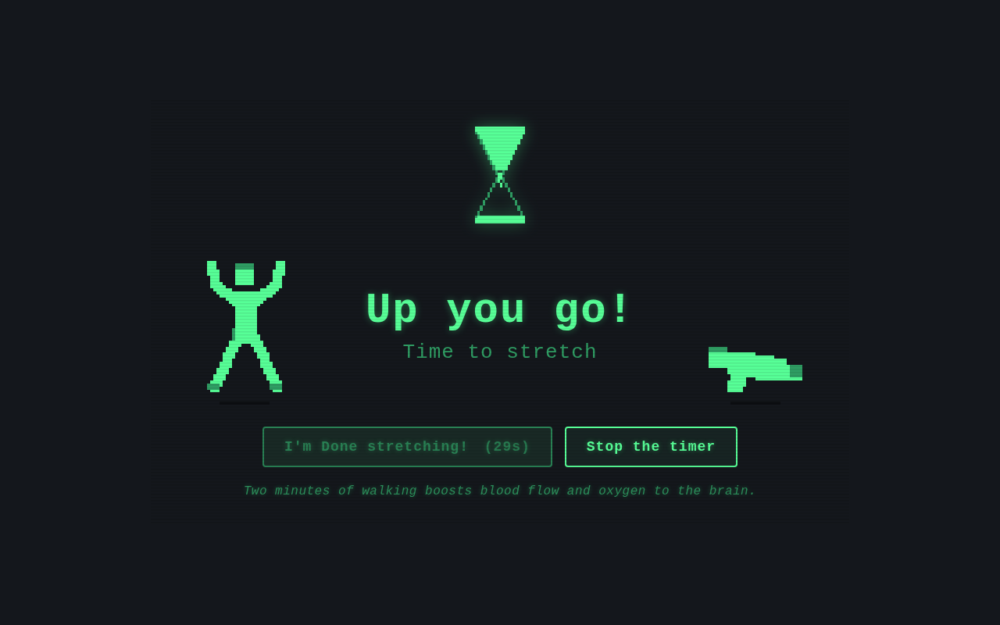
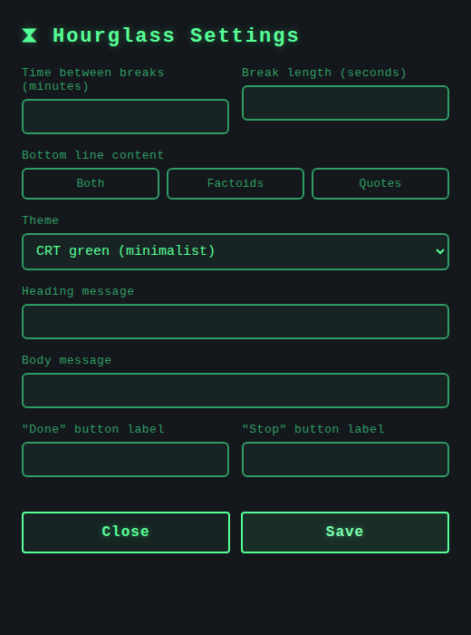

# Hourglass

~ A desktop break-reminder timer. Every *work period* it throws a full-screen,
always-on-top overlay over everything you're doing and makes you take a break —
a minimalist CRT-green look, a pixel-art hourglass dropping sand at the top, and
little animated 8-bit athletes doing jumping jacks, squats, stretches and pushups
on either side of the message.

> **v2 rewrite.** The original was a Java/Swing app (kept in [`legacy-java/`](legacy-java/)).
> It's been rebuilt as a [Tauri](https://tauri.app) app — a tiny native Rust
> shell hosting a web UI — because SVG, pixel animation and theming are native
> territory for HTML/CSS/Canvas and were awkward in Swing.

## The break overlay



When a break is due, Hourglass takes over the whole screen so you actually step
away. The default look is a minimalist **CRT phosphor-green on space grey**, with
scanlines and a faint flicker.

- **Pixel hourglass at the top**, with draining/filling sand + falling grains.
- **Flanking 8-bit exercise sprites** (jacks / squat / stretch / pushup), drawn
  procedurally — no image assets; left and right are phase-shifted and reversed
  so they're never doing the same move.
- **Heading + body message** in the middle (both editable).
- **"I'm Done" button is disabled for the break duration** (the countdown in
  brackets) — the same forced-break nudge as the original Java app. **"Stop the
  timer"** quits.
- **Rotating factoid / quote** along the bottom — health one-liners about why
  breaks help your body, mind and brain, plus quotes from great thinkers.

It's a **genuine fullscreen overlay, always-on-top, and sticky across virtual
desktops** — it follows you when you switch workspaces. On GNOME/Wayland the app
runs through XWayland to make those behaviours work (see
[How it works](#how-it-works)). `dark` (arcade) and `light` themes also ship and
are selectable in settings.

## Tray & settings

Hourglass lives in the system tray (the Ubuntu top bar). Left-click the
hourglass icon for the menu: **Settings…**, **Take a break now**,
**Pause / Resume**, and **Quit**. It stays resident in the tray until you Quit.



The **Settings** window edits everything and applies it live (no restart):

- **Time between breaks** (minutes) and **Break length** (seconds).
- **Bottom line content** — `Both`, `Factoids`, or `Quotes`.
- **Theme** — CRT green (default), Dark (arcade), or Light.
- The **heading / body** messages and the **two button labels**.

Changes are written to the config file (below) and pushed to a running overlay
immediately via a `config-updated` event.

## How it works

| Concern            | Where                                   |
|--------------------|-----------------------------------------|
| Work-period timing | `src-tauri/src/main.rs` — one async loop + `tokio::Notify`, interruptible by "break now" / "pause" via `tokio::select!` (replaces the Java two-thread `Lock` ping-pong) |
| Fullscreen/sticky window | `show_overlay()` in `main.rs` — sets monitor size + `set_fullscreen` + `set_visible_on_all_workspaces` (reliable on Wayland) |
| Tray + settings    | `build_tray()` in `main.rs`; settings window = `src/settings.html` + `settings.js` |
| Break UI + countdown | `src/main.js` |
| Pixel art          | `src/sprites.js` (procedural low-res canvas, blitted with `imageSmoothingEnabled=false`; mono-green in CRT theme) |
| Factoids / quotes  | `src/content.js` |
| Styling / themes   | `src/styles.css` (CSS custom properties swapped via `data-theme`) |
| Config             | JSON at the OS config dir (see below)    |

The loop: sleep `work_seconds` → show the overlay window + emit `break-start` →
the UI runs the break countdown → user clicks "I'm done" → `break_done` hides the
window and notifies the loop to start the next work period.

## Configuration

On first run a config file is created (and read every launch) at the platform
config dir, e.g. on Linux:

```
~/.config/com.guru227.hourglass/config.json
```

```json
{
  "work_seconds": 900,        // time between breaks (was buttonDisableDuration)
  "break_seconds": 30,        // forced break length / quit-button lock (was timerDuration)
  "msg_heading": "Up you go!",
  "msg_body": "Time to stretch",
  "quit_button_msg": "I'm Done stretching!",
  "terminate_button_msg": "Stop the timer",
  "theme": "crt",             // "crt" | "dark" | "light"
  "content_mode": "both"      // "both" | "factoids" | "quotes"
}
```

Easiest to edit via the **tray → Settings…** window; or edit the file and
relaunch. (Older files with `dark_mode` still load — unknown fields are ignored.)

> **Tray icons on GNOME/Ubuntu:** the tray icon needs the AppIndicator
> extension, which Ubuntu ships and enables by default. On vanilla GNOME you may
> need the "AppIndicator and KStatusNotifier" extension for the icon to appear.

## Building & running

### 1. System prerequisites (Linux)

Tauri compiles against the system WebKitGTK. **Once**:

```bash
sudo apt update
sudo apt install -y libwebkit2gtk-4.1-dev build-essential curl wget file \
  libxdo-dev libssl-dev libayatana-appindicator3-dev librsvg2-dev
```

(macOS: Xcode command-line tools. Windows: WebView2 + MSVC build tools.)

You also need the Rust toolchain (`https://rustup.rs`) and Node.

### 2. Run / build

```bash
npm install        # fetches the Tauri CLI
npm run dev        # hot-reloading dev run
npm run build      # produces a bundled installer in src-tauri/target/release/bundle/
```

> The frontend is plain HTML/CSS/JS in `src/` (no bundler), served directly via
> `frontendDist`. No build step for the UI.

### Preview the UI without building

The frontend degrades gracefully when the Tauri API is absent, so you can open
`src/index.html` in any browser to preview the overlay (it just shows the break
immediately and loops a fake work period on dismiss).

## Project layout

```
src/                 frontend (index.html, styles.css, main.js, sprites.js)
src-tauri/           Rust shell (Cargo.toml, tauri.conf.json, src/main.rs, capabilities/, icons/)
legacy-java/         the original Java/Swing version, preserved
```

## Yet to be implemented

- Multiple configurable hourglasses with custom messages.
- A GUI settings panel (currently config is the JSON file).
- System-tray controls (pause / snooze / quit).
